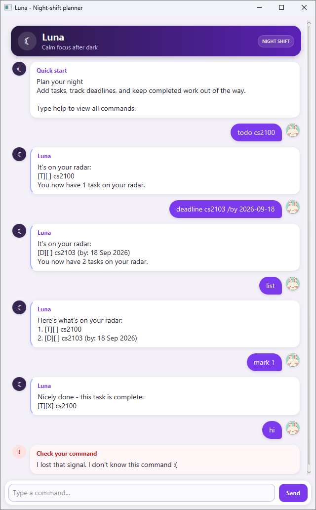

# Luna

**Luna** is a calm, chatbot-style task manager for keeping track of todos,
deadlines, and events. Luna saves your active and archived tasks locally so
they remain available after you close the application.



## Setup and run

### Requirements

Install JDK 25, then open a terminal and confirm that the correct Java version
is available:

```text
java -version
```

The output should start with `java version "25`. If the command is not found
or reports another version, install or select JDK 25 before continuing.

### Running the JAR

1. Place `luna.jar` in a dedicated folder where Luna can create its `data`
   folder.
2. Open a terminal in that folder.
3. Run:

   ```text
   java -jar luna.jar
   ```

Keep the generated `data` folder beside the JAR if you want your active and
archived tasks to remain available between sessions.

### Running from source

Open a terminal in the project folder and run the appropriate command.

On Windows:

```powershell
.\gradlew.bat run
```

On macOS or Linux:

```bash
./gradlew run
```

To build a distributable JAR instead, run `./gradlew shadowJar` or
`.\gradlew.bat shadowJar`. The result is saved as `build/libs/luna.jar`.

### Getting started

When Luna opens, enter commands in the text field at the bottom. Press
<kbd>Enter</kbd> or select **Send** to submit a command. Start with `help` to
display the command guide inside Luna.

## Reading command formats

- Words in angle brackets are values that you provide. For example, replace
  `<description>` with `read book`; do not type the angle brackets.
- Command names are not case-sensitive.
- Leading and trailing spaces are ignored, and extra spaces around parameter
  markers are accepted.
- Dates use `yyyy-MM-dd`, such as `2026-09-30`.
- Times use the 24-hour `HHmm` format, such as `0900` or `1830`.
- Separate an event's date and time with one space, for example
  `2026-09-30 1830`.
- Task indexes start from `1` and match the numbers shown by `list`.

## Command summary

| Action | Command |
|---|---|
| Display Luna's command guide | `help` |
| Add a todo | `todo <description>` |
| Add a deadline | `deadline <description> /by <yyyy-MM-dd>` |
| Add an event | `event <description> /from <yyyy-MM-dd HHmm> /to <yyyy-MM-dd HHmm>` |
| Display active tasks | `list` |
| Find active tasks | `find <keyword>` |
| Mark a task as completed | `mark <index>` |
| Mark a task as incomplete | `unmark <index>` |
| Permanently delete a task | `delete <index>` |
| Archive one task | `archive <index>` |
| Archive every active task | `archive all` |
| Display archived tasks | `list archived` |
| Exit Luna | `bye` |

## Features

### Viewing the command guide: `help`

Use `help` at any time to display all available commands and their formats.

```text
help
```

`help` does not change your tasks.

### Adding a todo: `todo`

Use `todo <description>` for a task without a date or time.

```text
todo read book
```

Luna displays todos using `[T]`:

```text
[T][ ] read book
```

### Adding a deadline: `deadline`

Use `deadline <description> /by <yyyy-MM-dd>` for a task due on a specific
date.

```text
deadline submit report /by 2026-09-30
```

Luna displays deadlines using `[D]` and a reader-friendly date:

```text
[D][ ] submit report (by: 30 Sep 2026)
```

The `/by` parameter is required and can appear only once. Non-existent dates,
such as `2026-02-30`, are rejected.

### Adding an event: `event`

Use `event <description> /from <start> /to <end>` for a task that spans a
specific time.

```text
event team meeting /from 2026-09-30 0900 /to 2026-09-30 1030
```

Luna displays events using `[E]`:

```text
[E][ ] team meeting (from: 30 Sep 2026, 9:00 AM to: 30 Sep 2026, 10:30 AM)
```

Use `/from` before `/to`, exactly once each. The end must be later than the
start; an equal or earlier end time is rejected.

Luna rejects an active task if another active task already has the same type
and details. Differences in capitalization, repeated spaces, or completion
status do not make a task unique.

### Displaying active tasks: `list`

Use `list` to display all active tasks and their current indexes.

```text
list
```

```text
Here's what's on your radar:
1. [T][ ] read book
2. [D][X] submit report (by: 30 Sep 2026)
```

`[ ]` means incomplete and `[X]` means completed. Run `list` before an
index-based command if you are unsure which index to use.

If there are no active tasks, Luna suggests how to add the first one:

```text
Your radar is clear - there are no active tasks yet.
Try todo <description> to add one.
```

### Finding active tasks: `find`

Use `find <keyword>` to search active task descriptions. Matching is not
case-sensitive.

```text
find report
```

```text
These tasks came into view:
1. [D][X] submit report (by: 30 Sep 2026)
```

Only active tasks are searched. Archived tasks are not included.
The displayed numbers remain the tasks' original indexes from `list`, so they
can be used directly with commands such as `mark` and `unmark`.

### Marking a task as completed: `mark`

Use `mark <index>` with an index shown by `list`.

```text
mark 1
```

The task changes from `[ ]` to `[X]`.

### Marking a task as incomplete: `unmark`

Use `unmark <index>` to return a completed task to the incomplete state.

```text
unmark 1
```

The task changes from `[X]` to `[ ]`.

### Permanently deleting a task: `delete`

Use `delete <index>` to permanently remove an active task.

```text
delete 2
```

> **Caution:** Deleted tasks are not placed in the archive and cannot be
> restored from within Luna. Use `archive` when you want to retain a task.

### Archiving one task: `archive`

Use `archive <index>` to move an active task into the archive.

```text
archive 2
```

Luna removes the task from the active list and renumbers the remaining tasks:

```text
Tucked away 1 task to data/archive.txt.
You have 2 tasks still on your radar.
```

### Archiving all active tasks: `archive all`

Use `archive all` to move every active task into the archive while preserving
their order.

```text
archive all
```

If the active list is empty, Luna leaves the archive unchanged.

### Displaying archived tasks: `list archived`

Use `list archived` to display archived tasks from oldest to newest.

```text
list archived
```

```text
These tasks are resting in your archive:
1. [T][ ] read book
2. [D][X] submit report (by: 30 Sep 2026)
```

Archived tasks are read-only. Luna cannot mark, unmark, delete, search, or
restore them. You can create and archive another task with the same details,
so duplicate archive entries are allowed.

### Exiting Luna: `bye`

Use `bye` without additional parameters to finish the session.

```text
bye
```

Luna shows the farewell response, then closes the application window after a
short delay.

## Error messages

Luna displays command errors in a pale-red card labelled **Check your
command**. The message explains which value or format needs correction.

Common solutions include:

- Enter `help` to confirm the command format.
- Enter `list` to check the latest active-task indexes.
- Use a positive whole number for `<index>`.
- Check that dates exist and follow `yyyy-MM-dd`.
- Check that event times follow `HHmm` and that the end is later than the
  start.
- Remove repeated or additional parameters from the command.

## Data storage and recovery

Luna stores data in the following plain-text files relative to the folder
from which it is launched:

- `data/luna.txt` contains active tasks.
- `data/archive.txt` contains archived tasks in archive order.

Missing files and folders are created automatically when Luna first saves
tasks. Avoid editing these files while Luna is running.

If the active-task file cannot be read because it is malformed, unavailable,
or access is denied, Luna starts a protected read-only session. Commands such
as `list`, `find`, `help`, and `bye` remain available, but commands that change
task data are blocked to prevent the existing file from being overwritten.
Close Luna, restore or correct the file or its permissions, and restart Luna
before making further changes.
